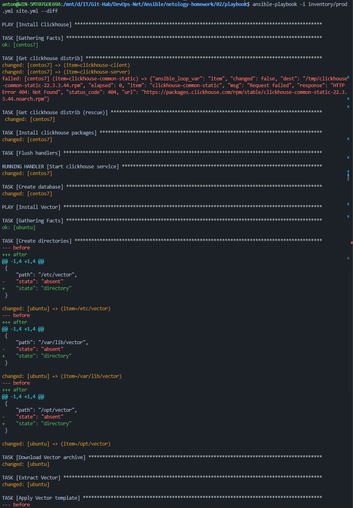
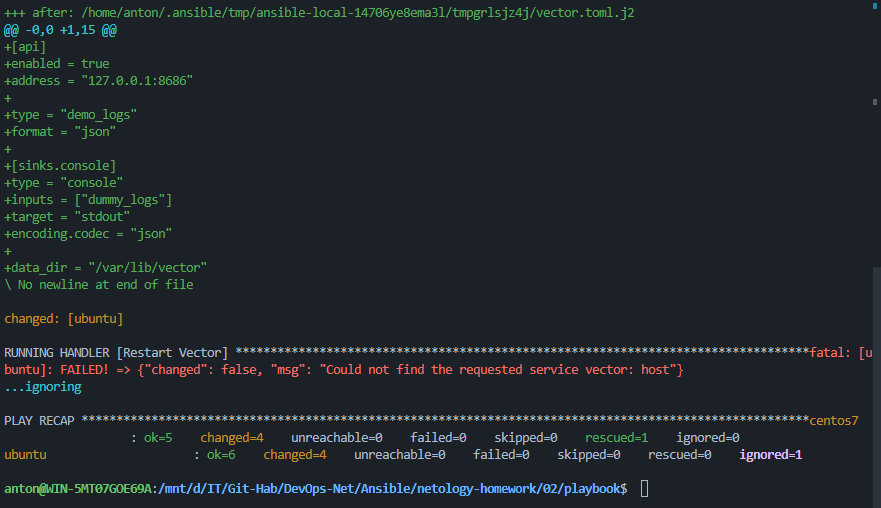

# Домашнее задание 02: Работа с Playbook

## Описание
Плейбук для автоматического развертывания аналитического стека:
- **Clickhouse DB**: Колоночная СУБД (устанавливается на CentOS 7).
- **Vector**: Сборщик логов (устанавливается на Ubuntu).

## Структура проекта
- `site.yml`: Основной манифест. Содержит два Play (сценария):
  1. Установка Clickhouse (использует блок `rescue` для обработки ошибок пакетов).
  2. Установка Vector (скачивание tar.gz, распаковка, шаблонизация конфига).
- `inventory/prod.yml`: Описание хостов (подключение через Docker).
- `group_vars/`: Переменные для версионирования (вынесены версии ПО и пути).
- `templates/vector.toml.j2`: Jinja2 шаблон конфигурации Vector.


## Скриншоты






## Команды
```bash
ansible-playbook -i inventory/prod.yml site.yml --diff
```

---
