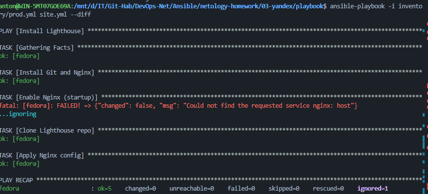

# Домашнее задание 03: Использование Ansible

## Описание
Плейбук разворачивает полный аналитический стек:
1. **Clickhouse** (CentOS 7) — База данных.
2. **Vector** (Ubuntu) — Сборщик логов.
3. **Lighthouse** (Fedora) — Веб-интерфейс для Clickhouse.

## Особенности реализации
- Используется модуль `git` для клонирования репозитория Lighthouse.
- Nginx настраивается как веб-сервер для статики.
- Реализована идемпотентность (повторный запуск не ломает систему).

## Команды
```bash
ansible-playbook -i inventory/prod.yml site.yml --diff
```

---


## Скриншоты

