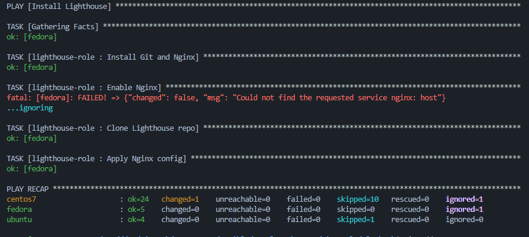

# Домашнее задание 04: Работа с ролями

## Описание
Данный плейбук разворачивает стек наблюдения (Clickhouse + Vector + Lighthouse) с использованием **Ansible Roles**.
Логика разбита на отдельные компоненты, хранящиеся в независимых репозиториях.

## Ссылки на роли
* **Роль Vector** (Собственная разработка):
    [https://github.com/Kot-off/vector-role](https://github.com/Kot-off/vector-role)
* **Роль Lighthouse** (Собственная разработка):
    [https://github.com/Kot-off/lighthouse-role](https://github.com/Kot-off/lighthouse-role)
* **Роль Clickhouse** (AlexeySetevoi):
    [https://github.com/AlexeySetevoi/ansible-clickhouse](https://github.com/AlexeySetevoi/ansible-clickhouse)

## Команды для запуска

### 1. Скачивание зависимостей
Перед запуском необходимо подтянуть роли из файла `requirements.yml`:
```bash
ansible-galaxy install -r requirements.yml -p roles
```

### 2. Запуск плейбука
```bash
ansible-playbook -i inventory/prod.yml site.yml --diff
```


## Скриншот


---
