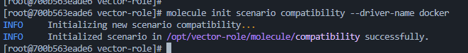
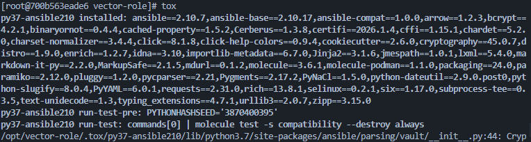

# Домашнее задание 05: Тестирование Roles

## Описание
В рамках данного задания настроено автоматизированное тестирование роли `vector-role` с использованием инструментов **Molecule** и **Tox**. Проверки осуществляются в изолированных Docker-контейнерах для различных дистрибутивов.

## Тестирование

### 1. Molecule
Для роли `vector-role` созданы сценарии тестирования:
* **default**: основной сценарий с использованием драйвера `docker`. Проверяет установку Vector на `Ubuntu` и `CentOS 7`.
* **compatibility**: облегченный сценарий для проверки совместимости.

**Команды для запуска тестов:**
```bash
cd roles/vector-role
molecule test
```

## Скриншот






---
