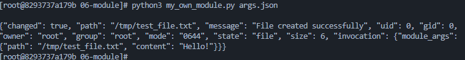
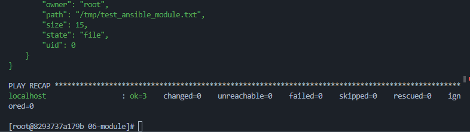
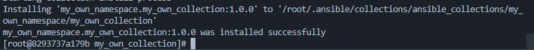
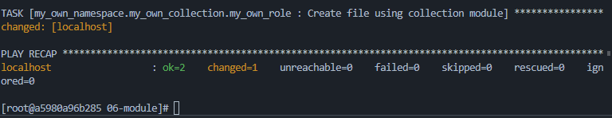

# Домашнее задание 06: Создание собственных модулей

## Описание
В рамках данного задания разработан собственный модуль Ansible на языке Python. Модуль предназначен для создания текстовых файлов на удаленных хостах по заданному пути с определенным содержимым. Модуль поддерживает принцип идемпотентности и упакован в состав собственной коллекции вместе с ролью.

## Состав коллекции
* **Модуль `my_own_module`**: Кастомный плагин для управления файлами.
* **Роль `my_own_role`**: Роль для вызова модуля с использованием переменных `defaults`.

---


### 1. Сборка и установка коллекции
Сборка коллекции в архив `.tar.gz` и установка в локальное окружение:
```bash
ansible-galaxy collection build
ansible-galaxy collection install my_own_namespace-my_own_collection-1.0.0.tar.gz -f
```

2. Запуск плейбука
Запуск основного плейбука, который использует роль из коллекции:

```Bash
ansible-playbook site.yml
```

Скриншоты выполнения
1. Локальная проверка модуля (Шаг 4)
Вызов модуля через интерпретатор Python с передачей JSON-аргументов. Подтверждает работоспособность кода и корректный возврат JSON-ответа.



2. Проверка идемпотентности (Шаг 6)
Повторный запуск плейбука. Результат changed=0 подтверждает, что модуль не вносит изменения, если состояние файла уже соответствует заданному.



3. Установка коллекции из архива (Шаг 15)
Демонстрация успешной установки собранного пакета коллекции в систему через утилиту ansible-galaxy.



4. Финальный запуск всей цепочки (Шаг 16)
Результат прогона плейбука site.yml. Подтверждает корректную работу всей связки: Playbook -> Role -> Custom Module из состава коллекции.



---
