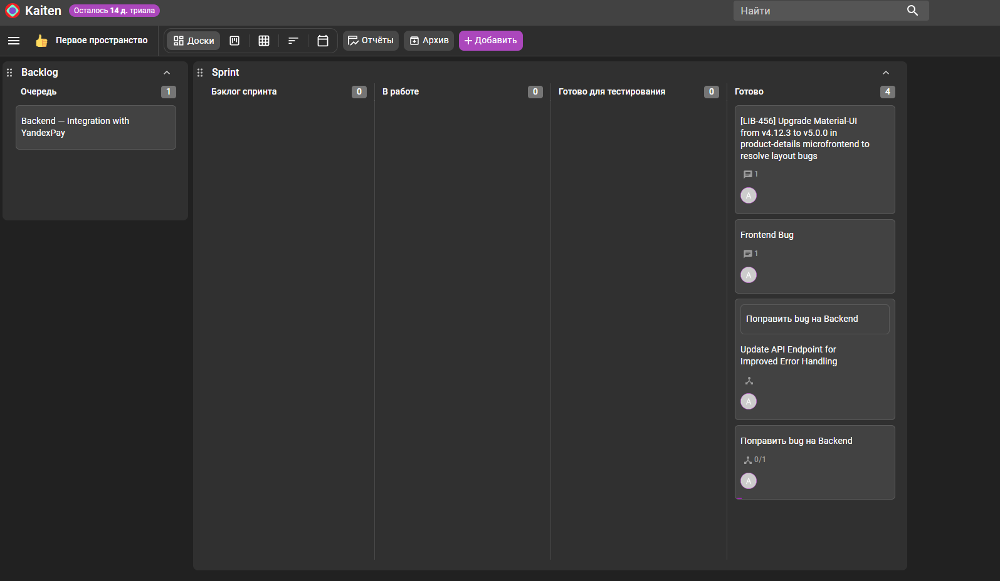

# Домашнее задание: Жизненный цикл ПО (Kaiten)

## Описание
В рамках данного задания была настроена система управления задачами в Kaiten. Были освоены принципы работы со Scrum-досками, создание иерархии задач (Parent/Child), управление трудозатратами и настройка кастомного рабочего процесса (Workflow).

## Выполненные работы

### 1. Настройка рабочего пространства
* Создана Scrum-доска.
* Настроен кастомный Workflow: добавлена колонка **«Готово для тестирования»** между этапами «В работе» и «Готово».

### 2. Управление задачами (Frontend)
* Создана родительская задача `Frontend Bug`.
* Создана дочерняя задача по обновлению библиотеки Material-UI.
* Пройден полный цикл: от Бэклога до завершения.
* Списаны трудозатраты (1ч и 0.2ч).

### 3. Управление задачами (Backend)
* Создана задача `Backend — Integration with YandexPay` (оставлена в Бэклоге).
* Отработан баг Backend через этап тестирования.
* Добавлены комментарии о прохождении тестов и списаны трудозатраты (4ч и 1ч).

## Результат
Итоговое состояние доски со всеми завершенными задачами представлено на скриншоте ниже.

---
