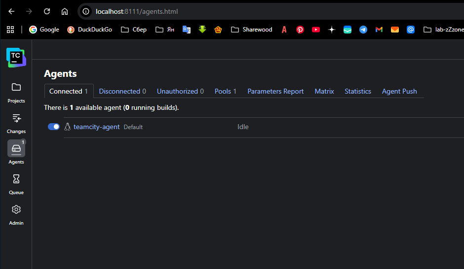
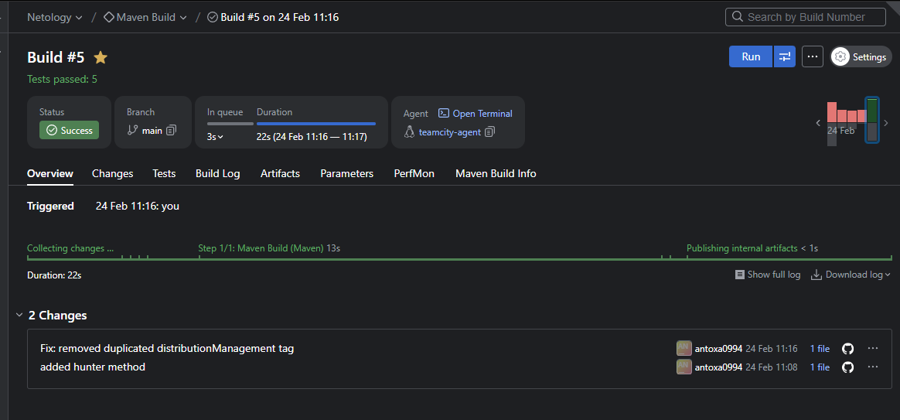
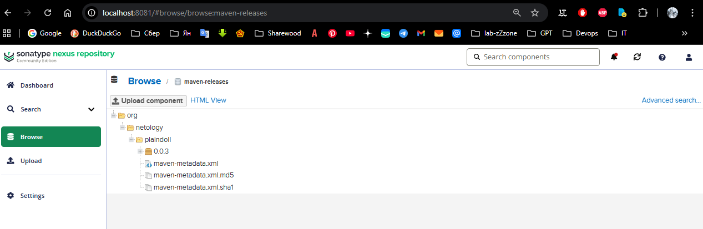

# Домашнее задание: Система непрерывной интеграции (TeamCity)

## Описание

В рамках данного задания была настроена система автоматизации сборки и деплоя (CI/CD) для Java-проекта. Основная цель — автоматизация тестирования кода и публикация готовых артефактов в репозиторий Nexus в зависимости от ветки репозитория.

## Выполненные работы

### 1. Настройка инфраструктуры

* Развернут локальный CI/CD стек: TeamCity Server, TeamCity Agent и Nexus Repository Manager через Docker Compose.
* Настроен агент сборки, успешно подключен к серверу (статус **Connected**).

### 2. Настройка CI/CD процесса (Workflow)

* Создан проект в TeamCity с привязкой к GitHub репозиторию.
* Настроены шаги сборки на базе **Maven**:
* **В ветке `main**`: выполняется команда `clean deploy` — полная сборка и отправка артефакта в Nexus.
* **В фича-ветках**: настроено условие на выполнение только `clean test` для проверки работоспособности кода без публикации.

* Интегрирован файл `settings.xml` для безопасной авторизации агента в Nexus.

### 3. Разработка и программная правка

* Реализована работа в ветке `feature/add_reply`.
* В код приложения (`HelloPlayer.java`) добавлен новый метод `hunter()`, возвращающий кастомное сообщение.
* Выполнен Merge фичи в ветку `main` после успешного прохождения тестов.

### 4. Управление артефактами

* Сборка версии **0.0.3** успешно прошла стадию публикации.
* Артефакт `plaindoll-0.0.3.jar` успешно загружен в репозиторий **maven-releases**.

## Результат

---
