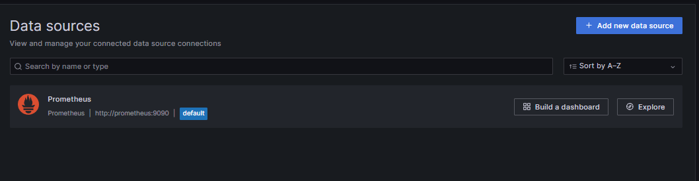
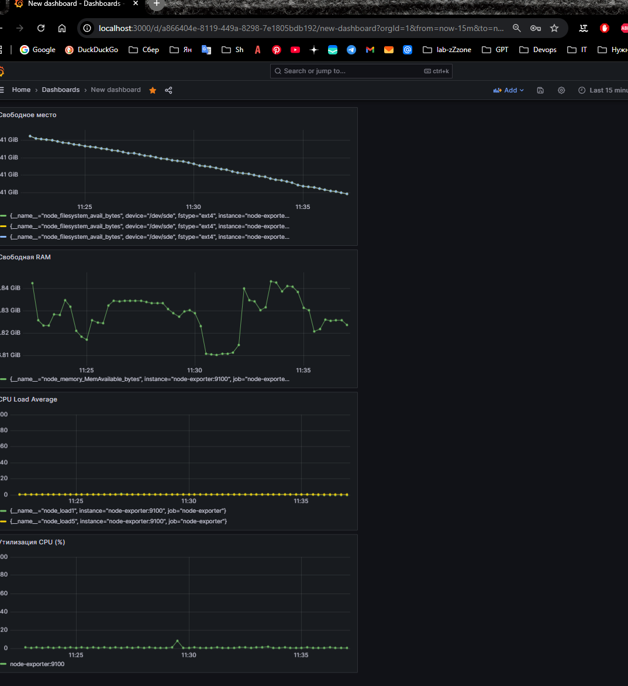
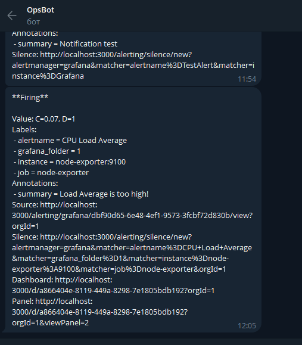

# Домашнее задание: Средство визуализации Grafana

## Описание

В рамках данного задания был самостоятельно развернут стек мониторинга (Задание повышенной сложности) и настроена визуализация ключевых системных метрик. Основной упор сделан на мониторинг состояния хоста и оперативную нотификацию об инцидентах через мессенджер Telegram.

## Выполненные работы

### 1. Развертывание стека (IaC)

Вместо использования готовых шаблонов, стек был развернут «с нуля» через Docker Compose. Конфигурация включает:

* **Prometheus**: сервер сбора и хранения метрик.
* **Node Exporter**: агент для извлечения метрик операционной системы.
* **Grafana**: платформа для визуализации и алертинга.

### 2. Настройка источников данных и Dashboards

* **Datasource**: Prometheus успешно подключен к Grafana как основной источник данных.
* **Визуализация**: Создан интерактивный дашборд, включающий 4 панели:
* **Утилизация CPU (%)**: отслеживание реальной нагрузки на процессор.
* **CPU Load Average**: мониторинг очередей задач (1/5/15 мин).
* **Свободная RAM**: оперативный контроль доступной памяти.
* **Свободное место**: мониторинг дискового пространства файловой системы.

### 3. Настройка системы оповещений (Alerting)

Реализована полноценная система уведомлений:

* Создан **Telegram-бот** и настроен канал связи через API.
* В Grafana настроен **Contact Point** (Telegram) и **Notification Policy**.
* Установлены пороговые значения (Thresholds) для метрики Load Average.
* Успешно протестирована отправка уведомлений: алерты приходят в мессенджер в режиме реального времени.

## Технические подробности

### Используемые PromQL-запросы:

1. **CPU Usage**: `100 - (avg by (instance) (irate(node_cpu_seconds_total{mode="idle"}[5m])) * 100)`
2. **Load Average**: `node_load1`
3. **Available RAM**: `node_memory_MemAvailable_bytes`
4. **Disk Space**: `sum(node_filesystem_avail_bytes{fstype!~"tmpfs|mqueue"})`

## Результаты

Итоговое состояние настроенного мониторинга и примеры уведомлений представлены ниже.

---

## Файлы проекта

* [docker-compose.yml](https://www.google.com/search?q=./01/docker-compose.yml) — манифест развертывания.
* [prometheus.yml](https://www.google.com/search?q=./01/prometheus.yml) — конфигурация сбора метрик.
* [grafana_dashboard.json](https://www.google.com/search?q=./01/grafana_dashboard.json) — экспортированная модель дашборда (Задание 4).

---
