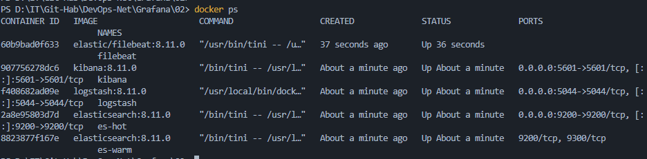
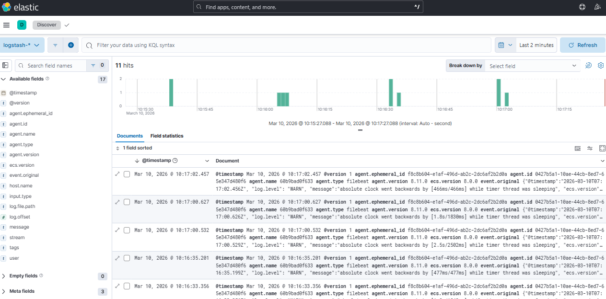

# Домашнее задание  «Система сбора логов Elastic Stack»

## Задание 1: Развертывание инфраструктуры

Стек поднят в Docker-контейнерах без использования вспомогательных материалов (директории `help`).

### Список запущенных сервисов:

* **es-hot**: Мастер-нода и хранилище «горячих» данных.
* **es-warm**: Нода для хранения «теплых» данных.
* **logstash**: Шлюз для обработки логов (настроены порты 5044 для Beats и 5045 для TCP JSON).
* **kibana**: Панель визуализации и управления.
* **filebeat**: Агент сбора логов с Docker-контейнеров системы.

**Статус системы:**

---

## Задание 2: Работа с данными в Kibana

### Проверка поступления логов

В Kibana успешно создан **Data View** с паттерном `logstash-*`. В разделе **Discover** отображаются логи в реальном времени.

---
