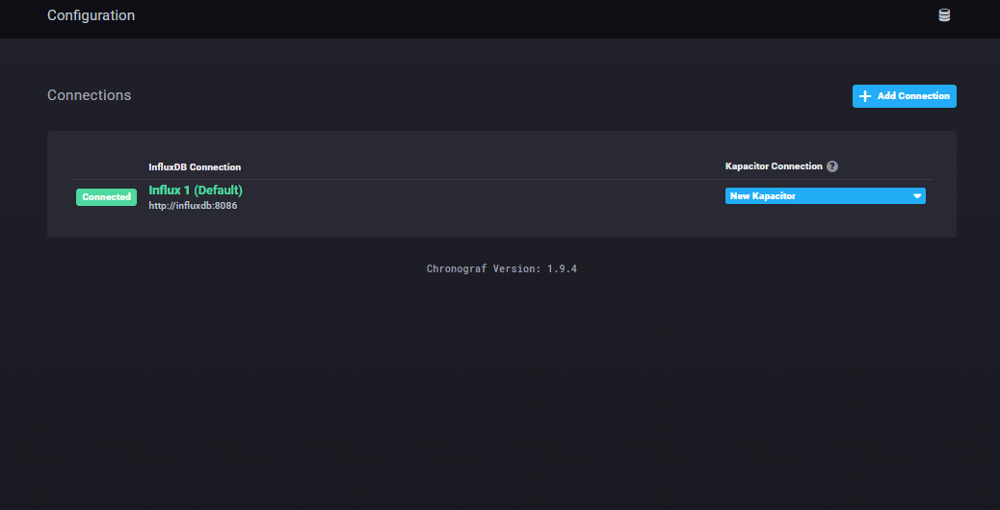
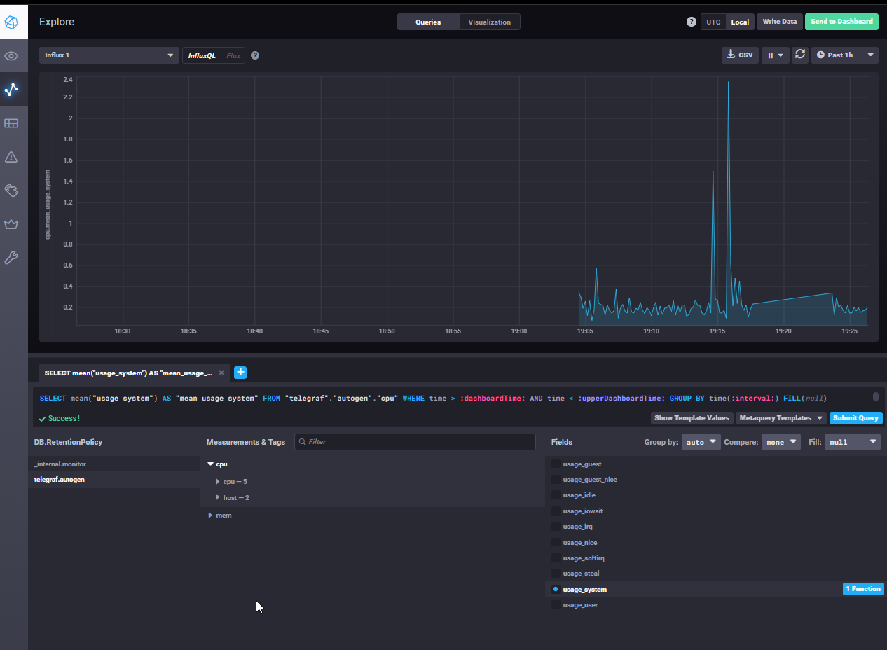
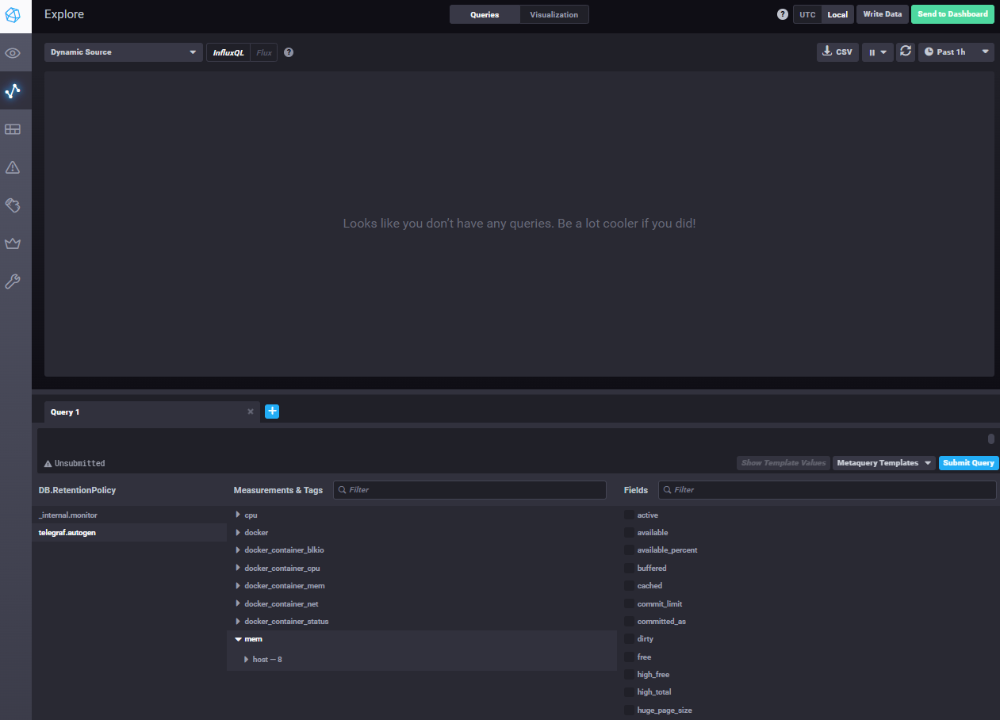

# "Системы мониторинга"

## Теоретическая часть

1. **Минимальный набор метрик:**
   * **CPU (User, System, IOWait):** Контроль вычислительной нагрузки и ожиданий ввода-вывода.
   * **HTTP RPS & Latency:** Количество запросов в секунду и время ответа (важно для UX).
   * **HTTP Status Codes (4xx, 5xx):** Процент ошибок для контроля стабильности API.
   * **Disk Space & Inodes:** Свободное место и количество индексных дескрипторов для записи отчетов.
   * **RAM Usage:** Контроль потребления памяти процессом.

2. **Предложение менеджменту:**
   Для измерения качества работы сервиса необходимо внедрить методологию SRE:
   * **SLI (Service Level Indicators):** Индикаторы (например, 99-й перцентиль времени ответа).
   * **SLO (Service Level Objectives):** Целевые показатели (например, время ответа < 200мс).
   * **SLA (Service Level Agreement):** Соглашение с клиентом о последствиях нарушения SLO.

3. **Сбор ошибок без бюджета:**
   Рекомендуется использование **Sentry (Self-hosted/Open Source)**. Позволяет собирать стектрейсы ошибок в реальном времени, группировать их и уведомлять разработчиков бесплатно (на своих мощностях).

4. **Ошибка в формуле SLA:**
   Формула `SLA = (summ_2xx_requests) / (summ_all_requests)` неверна, так как в знаменателе учитываются **3xx (редиректы)**. Они являются успешными операциями протокола, но из-за их наличия итоговый процент SLA будет ложно занижен.

5. **Плюсы и минусы PULL/PUSH:**
   * **PULL:** (+) Сервер сам опрашивает агентов, легче контролировать нагрузку. (-) Сложно собирать данные из-за NAT/Firewall.
   * **PUSH:** (+) Легко отправлять данные из-за NAT, подходит для динамических сред. (-) Риск перегрузки сервера (эффект "лавины").

6. **Классификация систем:**
   * **Prometheus:** PULL (преимущественно).
   * **TICK:** PUSH.
   * **Zabbix:** Гибрид (Push/Pull).
   * **VictoriaMetrics:** Гибрид (зависит от способа сбора).
   * **Nagios:** PULL.

---

## Практическая часть

### TICK-стек и мониторинг
Стек (Telegraf, InfluxDB, Chronograf, Kapacitor) запущен с помощью Docker Compose. Были решены проблемы прав доступа к сокету Docker и несоответствия версий API.

**Скриншот 1: Основной интерфейс Chronograf**

**Скриншот 2: График утилизации CPU**

**Скриншот 3: Метрики Docker (Measurements)**

---
