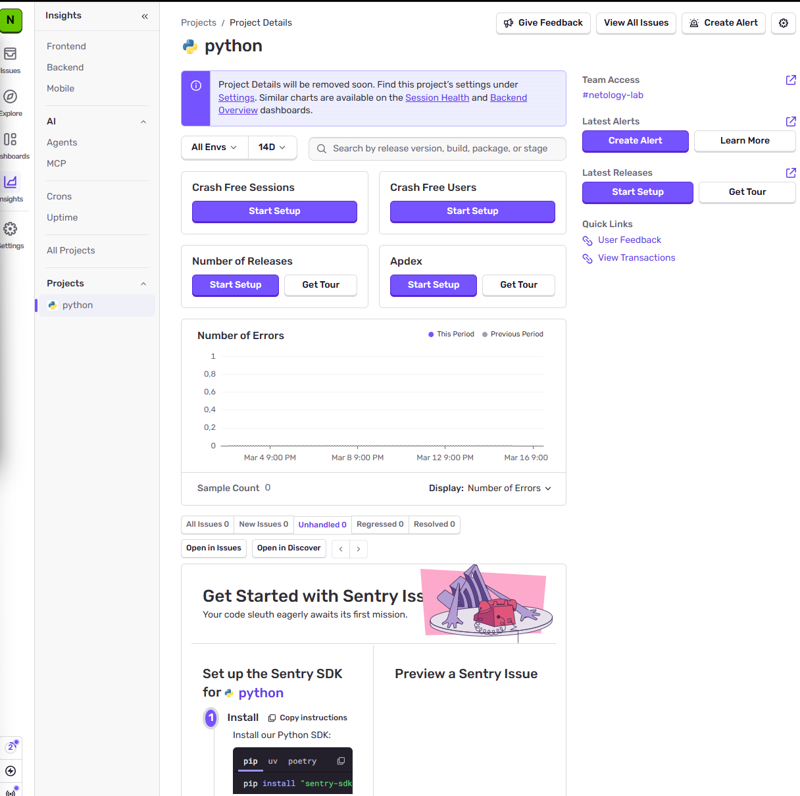
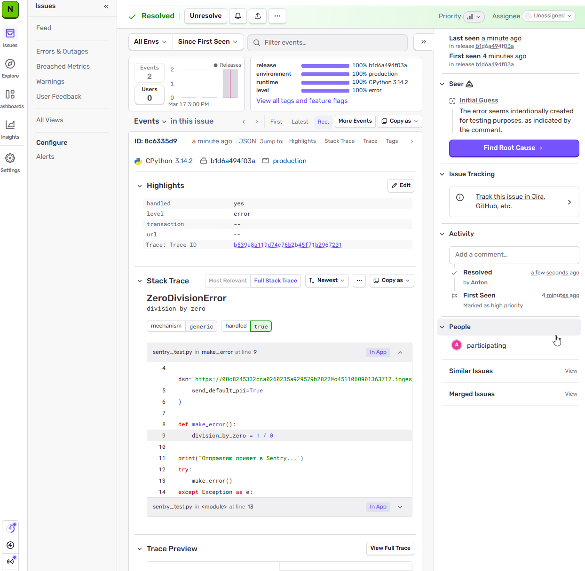
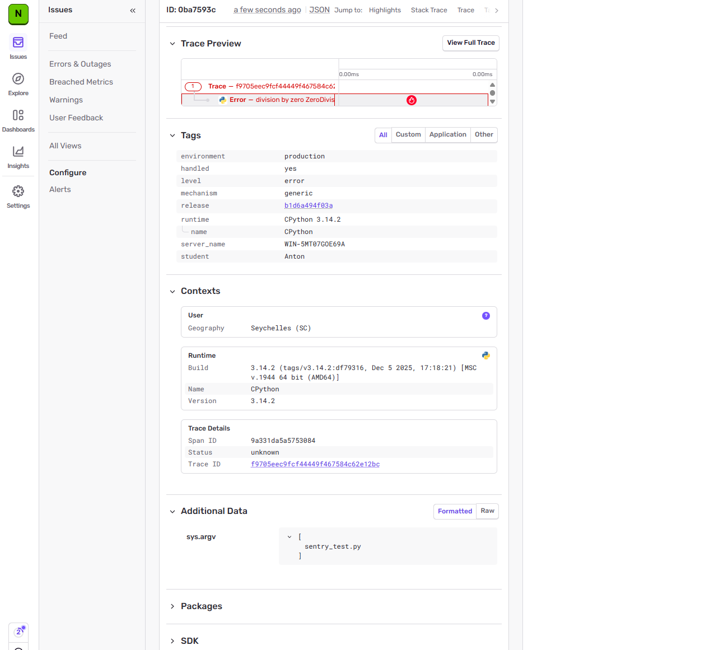
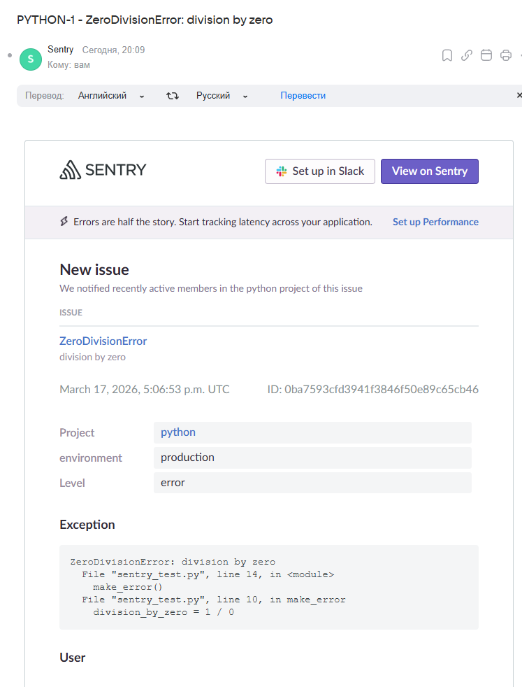

# «Платформа мониторинга Sentry»

## Практическая часть

### Задание 1: Настройка проекта
Зарегистрирован аккаунт в Sentry Cloud, создана организация и проект для языка Python.

**Скриншот меню Projects:**

---

### Задание 2: Изучение события и Resolution
Сгенерировано тестовое событие `ZeroDivisionError`. Изучен Stack Trace и статус события изменен на "Resolved".

**Скриншот Stack Trace:**

**Скриншот списка после нажатия Resolved:**
 

---

### Задание 3: Настройка алёртов
Создано правило оповещения (Alert Rule). При повторной генерации события на почту пришло уведомление.

**Скриншот письма из оповещения:**
 

---
