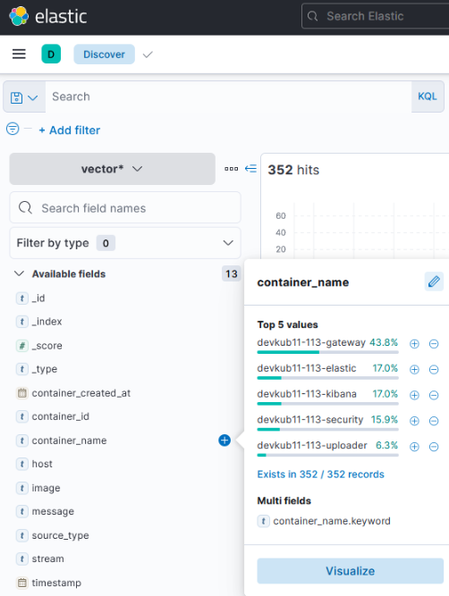
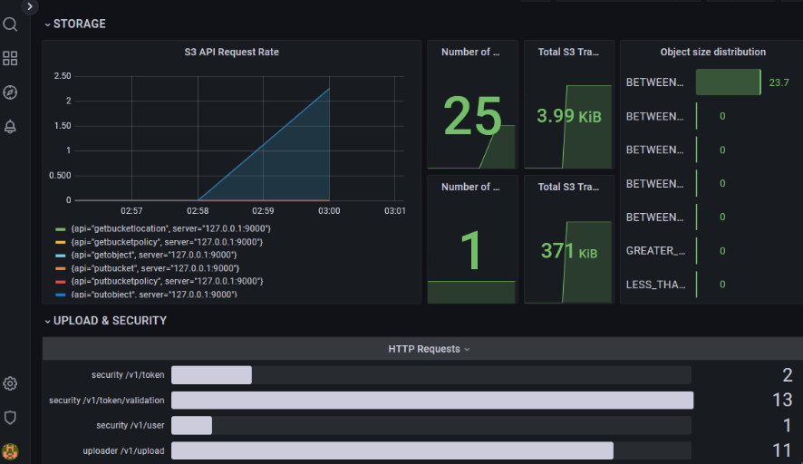

# Домашнее задание к занятию «Микросервисы: подходы»

## Задача 1: Обеспечение разработки (CI/CD)

**Решение:** GitLab + GitLab Runner.

**Обоснование:**
* **GitLab** — это self-hosted или облачное решение «все в одном». Оно объединяет хранилище кода, CI/CD пайплайны и Registry для Docker-образов.
* **Гибкость:** Позволяет запускать сборки по событию (push/merge) или вручную с параметрами.
* **Масштабируемость:** GitLab Runner можно развернуть на собственных серверах, что позволяет использовать свои мощности и параллельно запускать десятки тестов и сборок.
* **Безопасность:** Переменные окружения (CI/CD Variables) позволяют безопасно хранить ключи и пароли, маскируя их в логах.

---

## Задача 2: Сбор логов

**Решение:** ELK-стек в модификации **Vector + Elasticsearch + Kibana**.

**Обоснование:**
* **Vector:** Легковесный и быстрый агент. Он собирает логи напрямую из `stdout` контейнеров Docker, что соответствует требованию о минимальных правках в коде приложений.
* **Elasticsearch:** Стандарт индустрии для хранения и полнотекстового поиска. Позволяет мгновенно фильтровать миллионы строк логов.
* **Kibana:** Мощный интерфейс, где разработчики могут сохранять поисковые фильтры и делиться прямыми ссылками на конкретные инциденты.
* **Гарантия доставки:** Vector поддерживает буферизацию данных, что минимизирует риск потери логов при кратковременных сбоях сети.

---

## Задача 3: Мониторинг

**Решение:** Prometheus + Grafana + Node Exporter.

**Обоснование:**
* **Node Exporter:** Собирает все системные метрики хоста (CPU, RAM, Disk, Network).
* **cAdvisor/Docker Metrics:** Позволяют отслеживать потребление ресурсов каждым конкретным микросервисом.
* **Prometheus:** Использует Pull-модель, что упрощает мониторинг в динамической среде. Поддерживает сбор кастомных метрик через `/metrics`.
* **Grafana:** Позволяет строить сложные дашборды, объединяя данные из разных источников, и гибко настраивать визуализацию (Pie Charts, Graph, Heatmaps).

---

## Задача 4: Практика (Логи)

Стек Vector + ElasticSearch + Kibana развернут через Docker Compose. 

**Результат выполнения (Kibana Discover):**

---

## Задача 5: Практика (Мониторинг)

Настроен сбор метрик с сервисов API Gateway. В Grafana построен Dashboard распределения запросов.

**Результат выполнения (Grafana Dashboard):**
