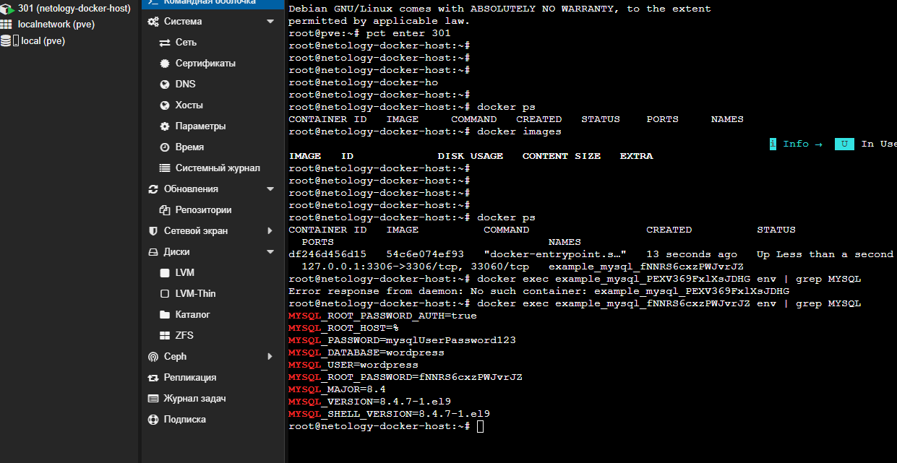

# Отчет по домашнему заданию: Основы Terraform / OpenTofu

## Обзор выполненной работы

Реализовано автоматизированное развертывание инфраструктуры «как код». Основная цель — создать среду для работы Docker на удаленном хосте Proxmox LXC и запустить там контейнер MySQL с динамическими настройками.

---

## Что было сделано

### 1. Развертывание хоста (Proxmox + Docker)

Я использовал модуль для создания контейнера LXC на базе Ubuntu 24.04 в Proxmox.

* **Автоматизация:** Для установки Docker я применил официальный скрипт `get.docker.com`, который вызывается через `provisioner "remote-exec"`.
* **Особенности LXC:** Чтобы Docker корректно работал внутри контейнера, я программно включил функцию `nesting` (вложенность) и принудительно настроил драйвер хранилища **VFS** через `daemon.json`, так как стандартный `overlay2` имеет ограничения в непривилегированных контейнерах.

### 2. Задание 2* (Удаленный Docker и MySQL)

Я настроил провайдер Docker для работы через **SSH-туннель**. Это позволило мне управлять контейнерами на удаленном LXC-хосте прямо со своего рабочего места.

* **Динамические параметры:** Имя контейнера и пароли (root и пользователь) генерируются автоматически через `random_password`.
* **Интерполяция:** Имя контейнера формируется на лету, например: `example_mysql_fNNRS6cxzPWJvrJZ`.
* **Безопасность:** Все секреты передаются в контейнер через переменные окружения (`env`).

### 3. Задание 3* (Переход на OpenTofu)

Вместо стандартного Terraform я использовал **OpenTofu v1.11.2**.

* Настроил зеркало Yandex Cloud в файле `terraform.rc` для корректной загрузки провайдеров в условиях ограничений.
* Убедился в полной совместимости кода с OpenTofu — деплой прошел без ошибок.


---

## Проблемы, с которыми я столкнулся (Troubleshooting)

В процессе работы я решил несколько серьезных технических проблем, что помогло мне лучше понять работу инструментов:

1. **SSH и права в Windows:** Мой SSH-ключ `id_ed25519` имел слишком широкие права, из-за чего подключение блокировалось. Я решил это через утилиту `icacls`, оставив доступ только своему пользователю.
2. **Доступ в Proxmox:** Столкнулся с ошибкой `403 Forbidden` при попытке включить некоторые функции LXC через API-токен. Оставил только необходимый флаг `nesting`, что позволило создать контейнер без использования учетки `root@pam`.
3. **Docker в LXC:** Изначально контейнеры не запускались из-за ошибки монтирования `/proc`. Я диагностировал проблему и перевел Docker на драйвер **VFS**, что является стандартом для работы внутри LXC.
4. **Порядок деплоя:** Так как провайдер Docker не может подключиться к хосту, которого еще нет, я использовал последовательный запуск через `-target="module.netology"`.

---

## Результат проверки

После завершения `tofu apply` я проверил состояние контейнера на удаленном хосте.

**Список запущенных контейнеров:**

```bash
root@netology-docker-host:~# docker ps
CONTAINER ID   IMAGE          COMMAND                  STATUS          NAMES
df246d456d15   mysql:8        "docker-entrypoint.s…"   Up 10 min       example_mysql_fNNRS6cxzPWJvrJZ
```

**Проверка переменных окружения (пароли совпадают со сгенерированными):**

```bash
root@netology-docker-host:~# docker exec example_mysql_fNNRS6cxzPWJvrJZ env | grep MYSQL
MYSQL_ROOT_PASSWORD=fNNRS6cxzPWJvrJZ
MYSQL_DATABASE=wordpress
MYSQL_USER=wordpress
MYSQL_PASSWORD=mysqlUserPassword123
```

---

### Как запустить мой проект:

1. Положить `terraform.rc` в профиль пользователя.
2. Заполнить `terraform.tfvars` своими данными.
3. Выполнить `tofu init`.
4. Сначала развернуть хост: `tofu apply -target="module.netology" -auto-approve`.
5. Затем развернуть приложение: `tofu apply -auto-approve`.

---
