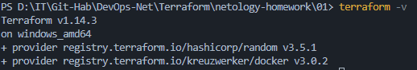
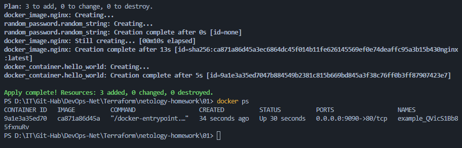
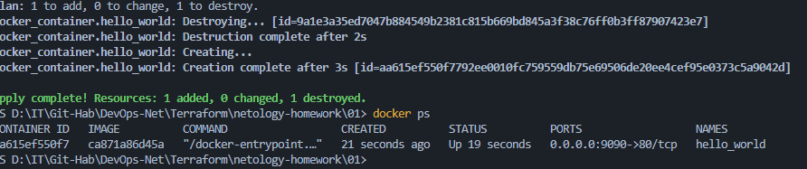
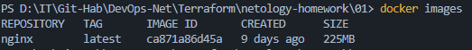

# «Введение в Terraform»

### Задание 1

**1. Установка Terraform**

* Версия Terraform: `1.14.3` <br>


**2. Секретные данные и .gitignore**
Согласно правилам, описанным в `.gitignore`, для хранения личной и секретной информации (логины, пароли, ключи) допустимо использовать файл:

* **`personal.auto.tfvars`**

**3. Секретное содержимое random_password**
В файле `terraform.tfstate` был найден сгенерированный пароль:

* **Ключ:** `"result"`
* **Значение:** `"QVicS1Bb85fxnuRv"`

**4. Исправление ошибок в main.tf**
При раскомментировании блока кода были обнаружены и исправлены следующие ошибки:

* **Ошибка имени ресурса:** Ресурс `docker_container "1nginx"` начинался с цифры. Согласно правилам именования Terraform, имена должны начинаться с буквы или подчеркивания. Изменено на `hello_world`.
* **Локальное имя образа:** У ресурса `docker_image` отсутствовало имя (было просто `resource "docker_image" {`). Добавлено имя `nginx`.
* **Ошибка интерполяции:** В ссылке на пароль было указано неверное имя ресурса (`random_string_FAKE` вместо `random_string`) и атрибут с ошибкой в регистре (`resulT` вместо `result`).

**5. Выполнение кода и docker ps**
Контейнер успешно запущен с динамическим именем.



**6. Замена имени на hello_world и -auto-approve**

* **Изменение:** Имя контейнера изменено на `hello_world`. Terraform произвел операцию `-/+ destroy and then create replacement`, так как изменение имени Docker-контейнера требует его пересоздания.
* **Вывод docker ps:**
* **Опасность `-auto-approve`:** Данный флаг исключает этап ручного подтверждения плана (`terraform plan`). Это опасно тем, что администратор может не заметить критических изменений (например, случайного удаления базы данных или пересоздания важного сервера) и применить их без возможности отмены.
* **Зачем нужен:** Ключ незаменим в автоматизированных процессах (CI/CD пайплайны), где выполнение кода происходит без участия человека.



**7. Уничтожение ресурсов**
Ресурсы успешно удалены командой `terraform destroy`. Содержимое итогового файла `terraform.tfstate`:

```json
{
  "version": 4,
  "terraform_version": "1.14.3",
  "serial": 11,
  "lineage": "6e8fd984-5a32-53f9-2a0f-6e02aec0a161",
  "outputs": {},
  "resources": [],
  "check_results": null
}

```

**8. Почему docker-образ nginx:latest не был удален?**
Образ остался в локальном хранилище Docker, так как в коде ресурса `docker_image` был установлен параметр:
`keep_locally = true`



**Обоснование из документации (провайдер Docker):**
[Документация](https://registry.terraform.io/providers/kreuzwerker/docker/latest/docs/resources/image.html)
> *"keep_locally (Boolean) If true, then the Docker image won't be deleted on destroy operation. If this is false, it will delete the image from the docker local storage on destroy operation."*

---