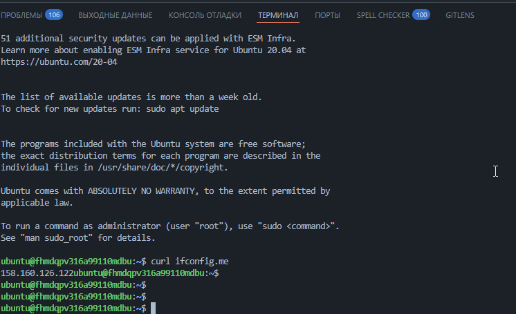
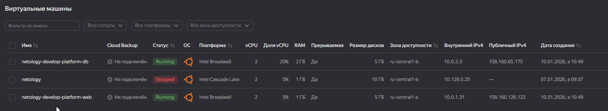
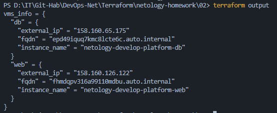
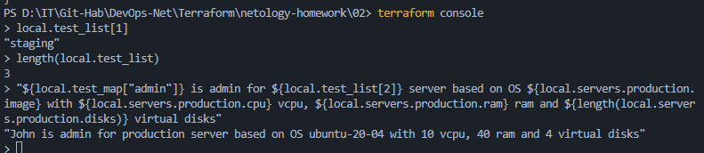
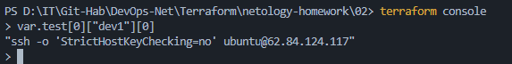

# Отчет по домашнему заданию к занятию «Основы Terraform. Yandex Cloud»

---

## Задание 1: Исправление ошибок и развертывание
При анализе исходного кода были исправлены критические ошибки в конфигурации ресурсов.
* Исправлен `platform_id`: опечатка `standart-v4` заменена на актуальную [standard-v1](https://yandex.cloud/ru/docs/compute/concepts/vm-platforms).
* Количество ядер (`cores`) приведено к минимально допустимому значению (2 vCPU).

### Техническое обоснование параметров:
1. **`preemptible = true` (Прерываемая ВМ)**: 
   Позволяет оптимизировать затраты на инфраструктуру (экономия до 80%). Согласно [документации Yandex Cloud](https://yandex.cloud/ru/docs/compute/concepts/preemptible-vm), такие ВМ подходят для отказоустойчивых нагрузок и обучения.
2. **`core_fraction = 5` (Гарантированная доля vCPU)**: 
   Использован экономный уровень производительности. Как указано в [описании уровней производительности](https://yandex.cloud/ru/docs/compute/concepts/performance-levels), это оптимально для задач с низкой средней нагрузкой.

  
*Скриншот 1: Виртуальные машины созданы и имеют внешние IP.*

*Скриншот 1.1: Проверка внешнего IP через SSH совпадает с данными в панели управления.*

---

## Задания 2-6: Рефакторинг и масштабируемость
Для улучшения структуры кода применены следующие инструменты Terraform:

* **Переменные и сложные типы**: Использована переменная типа `map(object)` для централизованного управления ресурсами всех ВМ.
  * [Документация: Variable Types and Values](https://developer.hashicorp.com/terraform/language/values/variables)
* **Локальные переменные (Locals)**: Имена машин формируются динамически, что исключает дублирование строк.
  * [Документация: Local Values](https://developer.hashicorp.com/terraform/language/values/locals)
* **Metadata**: Использование общей переменной для блока `metadata` позволяет стандартизировать настройки SSH-доступа для всего парка ВМ.
  * [Документация: Metadata в Yandex Compute](https://yandex.cloud/ru/docs/compute/concepts/vm-metadata)

  
*Скриншот 2: Структурированный вывод информации о машинах.*

---

## Задание 7* (Terraform Console)
[Документация: Terraform Functions](https://developer.hashicorp.com/terraform/language/functions)

В ходе работы в интерактивном режиме `terraform console` были выполнены следующие манипуляции с данными из `console.tf`:

1. **Отображение второго элемента списка:**
* Команда: `local.test_list[1]`
* Ответ: `"staging"`

1. **Определение длины списка:**
* Команда: `length(local.test_list)`
* Ответ: `3`

1. **Получение значения по ключу из map:**
* Команда: `local.test_map["admin"]`
* Ответ: `"John"`

1. **Сложная интерполяция строки:**
* Команда: `"${local.test_map["admin"]} is admin for ${local.test_list[2]} server based on OS ${local.servers.production.image} with ${local.servers.production.cpu} vcpu, ${local.servers.production.ram} ram and ${length(local.servers.production.disks)} virtual disks"`
* Ответ: `"John is admin for production server based on OS ubuntu-20-04 with 10 vcpu, 40 ram and 4 virtual disks"`

---

## Задание 8* (Вложенные структуры)
Была объявлена переменная `test` со сложной структурой `list(map(list(string)))`. Для извлечения конкретной строки SSH-подключения использовалась навигация по индексам и ключам:

* **Команда:** `var.test[0]["dev1"][0]`
* **Результат:** `"ssh -o 'StrictHostKeyChecking=no' ubuntu@62.84.124.117"`

---

### Инструкция по запуску
1. `terraform init` — инициализация проекта.
2. `terraform apply -auto-approve` — развертывание инфраструктуры.
3. `terraform destroy -auto-approve` — полное удаление ресурсов.
