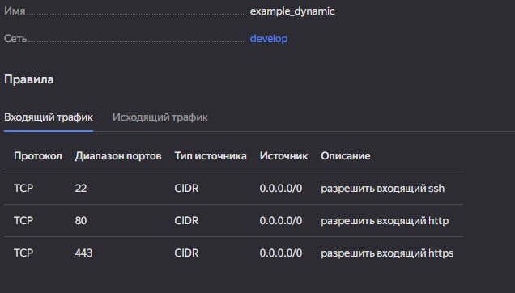
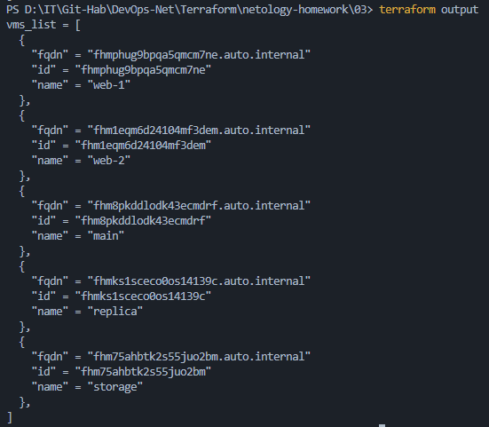
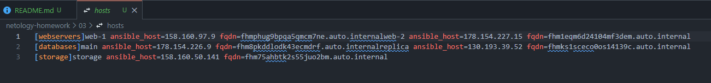

# Отчет по домашнему заданию к занятию «Управляющие конструкции в коде Terraform»

## Описание проекта

В данной работе реализована отказоустойчивая и масштабируемая инфраструктура в Yandex Cloud. Основное внимание уделено автоматизации процессов создания ресурсов с помощью управляющих конструкций Terraform, что позволило полностью исключить «хардкод» из конфигурации.

---

## Задание 1: Группы безопасности

Для управления трафиком создана группа безопасности `example_dynamic` с использованием динамических блоков.

* **Решение**: Вместо дублирования кода для каждого порта, использован блок `dynamic "ingress"`, который итерируется по переменной `security_group_ingress`.
* **Результат**: Разрешен входящий трафик для SSH (22), HTTP (80) и HTTPS (443).
* [Документация: Dynamic Blocks](https://www.google.com/search?q=https://developer.hashicorp.com/terraform/language/expressions/dynamic-blocks)

*Скриншот 1: Входящие правила группы безопасности в консоли Yandex Cloud.*


---

## Задание 2: Использование count и for_each

Использовал два типа циклов для создания ВМ:

1. **Цикл `count**`: Созданы две идентичные ВМ `web-1` и `web-2`. Это решение оптимально для горизонтального масштабирования веб-серверов.
2. **Цикл `for_each**`: Созданы две ВМ для баз данных `main` и `replica` с индивидуальными настройками CPU и RAM (через `each.value`).
3. **Зависимости**: Использован аргумент `depends_on = [yandex_compute_instance.db]` в ресурсе веб-серверов. Это гарантирует, что веб-часть не начнет разворачиваться до полной готовности базы данных.
4. **Экономия**: Для всех ВМ установлена гарантированная доля vCPU `core_fraction = 5` и режим `preemptible = true`.

---

## Задание 3: Динамические диски и Storage VM

Создана специализированная ВМ `storage` с расширяемой дисковой подсистемой:

* С помощью `count` созданы 3 дополнительных диска по 1 ГБ.
* Через блок **`dynamic "secondary_disk"`** реализовано их автоматическое подключение к ВМ. Такой подход позволяет изменять количество подключаемых дисков одной цифрой в переменной.

---

## Задание 4: Шаблон Ansible Inventory

Подготовлен файл-шаблон `hosts.tftpl`, который преобразует данные из ресурсов Terraform в формат, понятный Ansible.

* **Механизм**: Функция `templatefile` считывает шаблон и подставляет в него актуальные IP и FQDN всех 5 машин (объединяя данные из `count` и `for_each`).
* **Группировка**: В шаблоне реализовано разделение хостов по группам: `[webservers]`, `[databases]` и `[storage]`.

---
## Задание 5* (Structured Output)

Настроен `output` для вывода данных всех созданных машин в виде единого списка объектов (name, id, fqdn). Это упрощает мониторинг состояния ресурсов после развертывания.

*Скриншот 3: Вывод структурированных данных о развернутых ресурсах в терминале.* <br>


---

## Задание 6: Автоматизация генерации Inventory

Для полной автоматизации процесса использован ресурс `local_file` в файле `ansible.tf`.

* **Результат**: При выполнении `terraform apply` Terraform автоматически создает или обновляет файл `hosts` в корне проекта. Это исключает ручные ошибки при заполнении IP-адресов.

Скриншот 2: Сгенерированный inventory-файл со всеми активными хостами.


---

## Задания 7*-8*-9* (Работа в Terraform Console)

В ходе работы с интерактивной консолью (`terraform console`) выполнены следующие операции трансформации данных:

**Задание 7 (Фильтрация)**: Из объекта `local.vpc` удален 3-й элемент списков с помощью конструкции:
```hcl
[for i, v in local.vpc : v if i != 2]
```
- Документация: [Terraform Expressions — For Expressions](https://developer.hashicorp.com/terraform/language/expressions/for) Раздел "Filtering Elements". Там показано, как добавить if в конец выражения, чтобы отсеять ненужные данные (например, по индексу или значению).

**Задание 8 (Исправление ошибок)**: Устранена ошибка обращения к вложенным структурам в шаблоне `.tftpl` (исправлена логика итерации по списку объектов).
Изучить синтаксис директив внутри строк и шаблонов:
- Документация (Функция): [Terraform Functions — templatefile](https://developer.hashicorp.com/terraform/language/functions/templatefile)
- Документация (Синтаксис): [String Templates Directives](https://developer.hashicorp.com/terraform/language/expressions/strings)

Разделы про циклы %{ for ... } и условия %{ if ... }. Ошибка часто кроется в том, что переменная внутри шаблона воспринимается как кортеж (tuple), а к ней пытаются обратиться как к объекту (или наоборот).
  
**Задание 9 (Генерация имен)**: Создан генератор имен серверов `rc01-rc99` с пропуском каждого десятого имени:
```hcl
[for i in range(1, 100) : format("rc%02d", i) if i % 10 != 0]
```

Тут используются две основные функции: одна создает последовательность чисел, вторая превращает их в красивые строки (например, добавляет ведущий ноль).

Функция `range`: [Terraform Functions — range](https://developer.hashicorp.com/terraform/language/functions/range)
 — генерирует список чисел.

Функция `format`: [Terraform Functions — format](https://developer.hashicorp.com/terraform/language/functions/format)
 — работает аналогично printf в языке C.

В format для задания 9 чаще всего используется флаг %02d. Он означает: «выведи десятичное число, и если в нем меньше двух знаков, добавь впереди ноль».

---

### Запуск проекта

1. `terraform init` — инициализация проекта.
2. `terraform plan` — проверка плана изменений.
3. `terraform apply -auto-approve` — развертывание и генерация `hosts`.
4. `terraform destroy -auto-approve` — удаление всех ресурсов.

---
