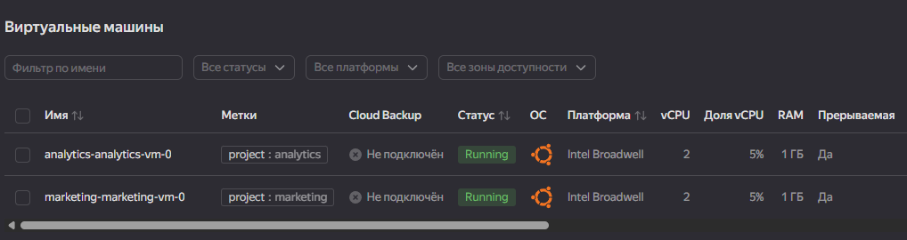
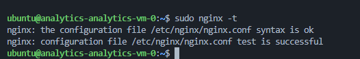
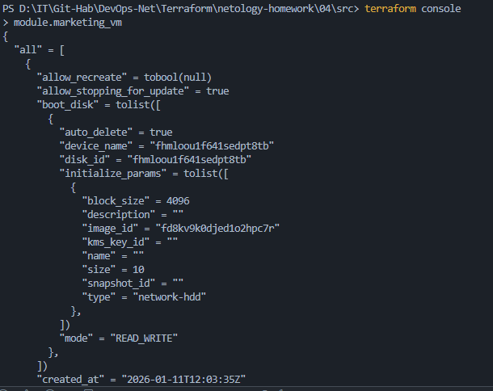
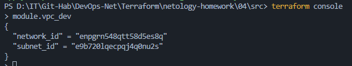
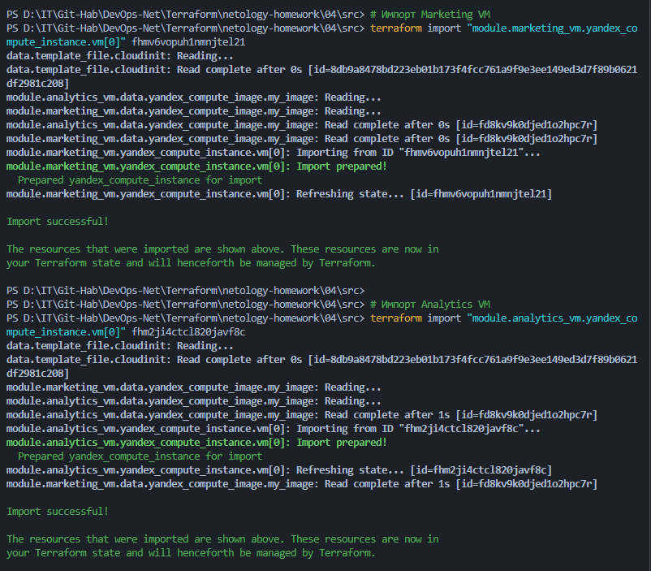
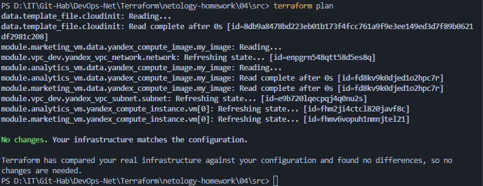
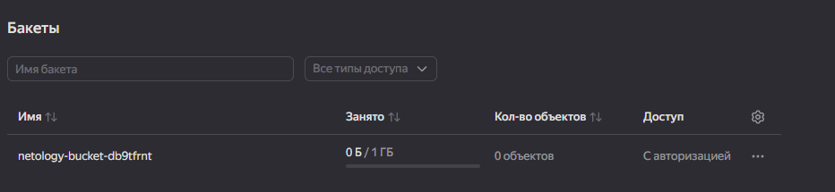

# Отчет по домашнему заданию к занятию «Продвинутые методы работы с Terraform. Модули»

---

## Задание 1: Использование Remote-модулей

Для развертывания виртуальных машин использован внешний модуль из публичного репозитория.

* **Решение**: В файле `main.tf` объявлены два модуля: `marketing_vm` и `analytics_vm`. Настройка ОС выполнена через динамический `cloud-init.yml`.
* **Результат**: Развернуты две прерываемые ВМ с предустановленным Nginx и настроенными метками проектов.

**Команды**:

```bash
# Инициализация и скачивание внешних модулей
terraform init

# Проверка внешних IP-адресов созданных ВМ
terraform console
> module.marketing_vm.external_ip_address

```

*Скриншот 1: Список ВМ с метками в консоли Yandex Cloud.*


*Скриншот 2: Проверка работоспособности Nginx через SSH (sudo nginx -t).*


---

## Задание 2 и 4*: Локальный модуль VPC

Реализован собственный модуль для управления сетевой инфраструктурой. Код VPC вынесен в отдельную папку `vpc`. Модуль принимает список объектов `subnets` и создает подсети в цикле `for_each`.

**Команды**:

```bash
# Генерация документации для локального модуля
terraform-docs markdown vpc > vpc/README.md

# Проверка ID подсети конкретной зоны через консоль
terraform console
> module.vpc_dev.subnets["ru-central1-a"].id

```

*Скриншот 3: Вывод данных модуля marketing_vm в консоли.*


*Скриншот 4: Вывод карты подсетей модуля vpc_dev.*


---

## Задание 3: Манипуляции со State (RM, Import и Moved)

Отработаны навыки рефакторинга без прерывания работы сервисов. При переходе на `for_each` в модуле VPC возник конфликт имен, который был решен через обновление стейта.

**Команды и методы**:

1. **Удаление из стейта**:
```bash
terraform state rm 'module.vpc_dev.yandex_vpc_subnet.subnet'

```


2. **Импорт существующего ресурса**:
```bash
terraform import 'module.vpc_dev.yandex_vpc_subnet.subnet["ru-central1-a"]' <ID_подсети>

```


3. **Декларативное перемещение** (блок `moved` в `main.tf`):
```hcl
moved {
  from = module.vpc_dev.yandex_vpc_subnet.subnet
  to   = module.vpc_dev.yandex_vpc_subnet.subnet["ru-central1-a"]
}

```

*Скриншот 5: Процесс импорта ресурсов в терминале.*


*Скриншот 6: Финальный terraform plan (No changes).*


---

## Задание 6*: Облачное хранилище S3

Реализовано создание бакета через официальный модуль Yandex Cloud. Для обеспечения безопасности использован отдельный сервисный аккаунт со статическими ключами.

**Команды**:

```bash
# Поиск созданного бакета в стейте
terraform state list | grep s3_bucket

```

*Скриншот 7: Созданный S3 бакет в консоли Yandex Cloud.*


---

## Итоговый цикл запуска проекта

```bash
# 1. Очистка и инициализация
Remove-Item -Recurse -Force .terraform
terraform init

# 2. Проверка плана и применение
terraform plan
terraform apply -auto-approve

# 3. Удаление
terraform destroy
```

---
