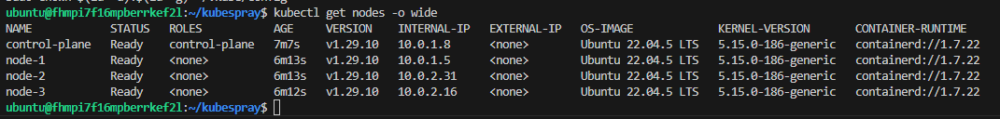
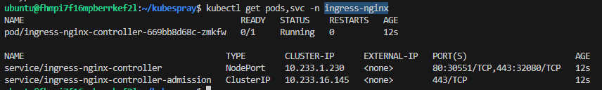
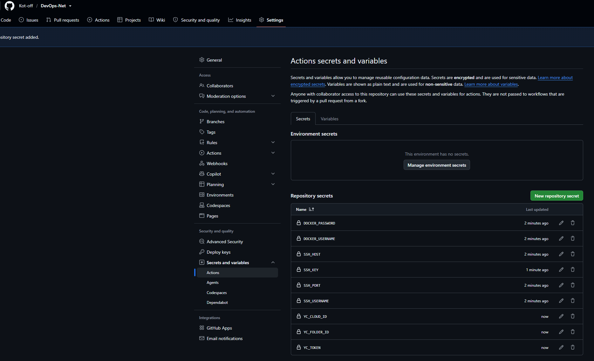
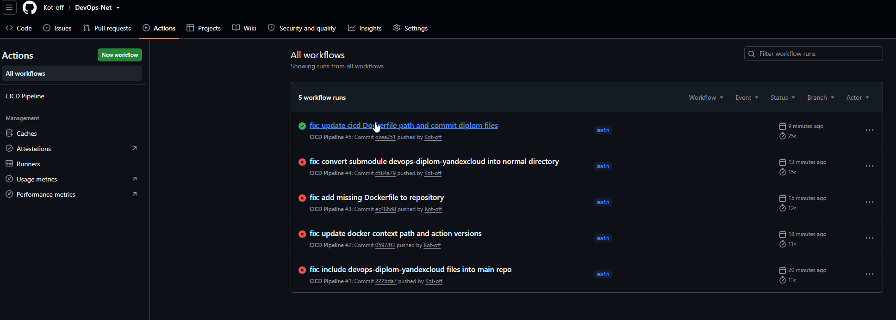
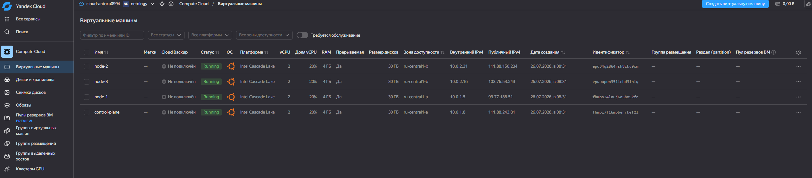
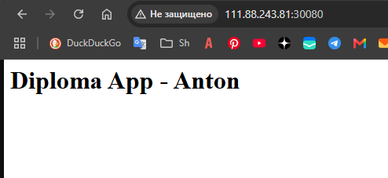
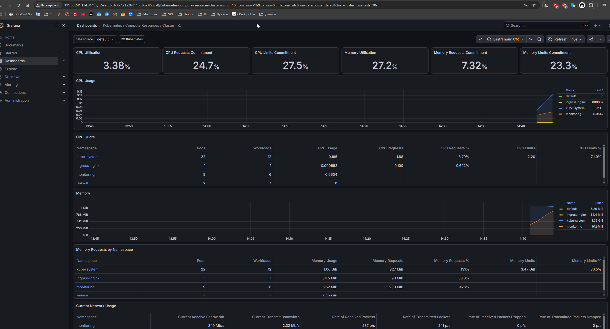
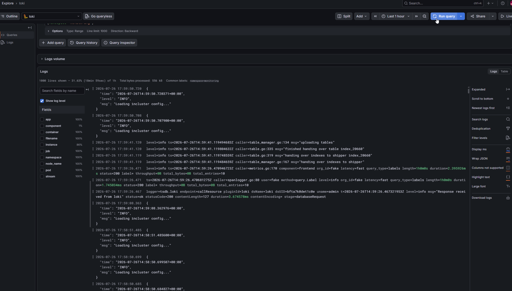

# Дипломный практикум: Облачная инфраструктура и CI/CD в Yandex Cloud

**Выполнил:** Антон V.  
**Проект:** Дипломный практикум в Yandex.Cloud  

---

## Описание проекта

В рамках дипломного практикума была развернута отказоустойчивая и автоматизированная облачная инфраструктура для запуска микросервисных приложений в Kubernetes.

### Ключевые компоненты:
* **IaC (Infrastructure as Code):** Автоматическое создание ВМ и сетевой инфраструктуры через **Terraform**.
* **Orchestration & Cluster:** Кластер **Kubernetes (v1.29.10)**, развернутый с помощью **Kubespray**.
* **CI/CD:** Пайплайн в **GitHub Actions** для сборки Docker-образов и их автоматического деплоя в K8s.
* **Observability:** Стек мониторинга и логирования на базе **Prometheus**, **Grafana** и **Loki**.
* **Ingress:** Маршрутизация трафика через **NGINX Ingress Controller**.

---

## 1. Создание облачной инфраструктуры (Terraform)

Инфраструктура описана с помощью конфигурационных файлов Terraform. В качестве бэкенда для хранения `terraform.tfstate` используется **S3 Object Storage** в Yandex Cloud.

* **Виртуальные машины:** 1 Control-plane нода и 3 Worker-ноды.
* **Тип ВМ:** Прерываемые (Interruptible) для оптимизации стоимости ресурсов.
* **Сеть:** VPC с подсетями в разных зонах доступности (`ru-central1-a`, `ru-central1-b`).

---

## 2. Развертывание Kubernetes кластера (Kubespray)

Установка кластера выполнена с помощью **Kubespray**. В результате развернута контрольная панель и 3 воркер-ноды.

### Проверка состояния кластера:
```bash
kubectl get nodes -o wide
```

---

## 3. Мониторинг и Логирование (Prometheus, Grafana, Loki)

Для контроля состояния инфраструктуры и приложения в кластер развернут стек observability:

* **Prometheus:** Сбор метрик с нод и подов.
* **Grafana:** Дашборды ресурсов кластера (CPU, RAM, Network).
* **Loki:** Централизованный сбор и просмотр логов приложения и системных компонентов.

### Доступ к сервисам:

* **Grafana Web UI:** `http://111.88.241.124:31495`
* **Доступ:** `admin` / *(пароль от Grafana)*

---

## 4. Сборка и Автоматический Деплой (CI/CD)

Настроен автоматический CI/CD процесс с использованием **GitHub Actions**.

### Логика работы пайплайна:

1. **Job `build`:**
* Авторизация в Docker Hub.
* Сборка Docker-образа приложения из файла `./devops-diplom-yandexcloud/Dockerfile`.
* Тегирование образом `${{ github.run_number }}` и `latest`.
* Push образа в Docker Hub.


2. **Job `start-vm`:**
* Проверка статуса control-plane ВМ в Yandex Cloud через `yc CLI`.
* Автоматический запуск ВМ, если она была остановлена.


3. **Job `deploy`:**
* Подключение к кластеру по SSH (с использованием SSH-ключей и Service Account Key YC).
* Генерация Kubernetes-манифестов для `Deployment` и `Service` (NodePort).
* Применение манифестов через `kubectl apply`.
* Вывод текущего состояния подов и сервисов (`kubectl get pods,svc -o wide`).


### Ссылка на тестовое приложение:

* **URL:** `http://111.88.241.124:30080/`
* **Текст на странице:** `Diploma App - Anton`

---

## Скриншоты

### 1. Список нод Kubernetes


### 2. Запущенный NGINX Ingress Controller


### 3. Секреты репозитория GitHub


### 4. Успешный запуск CI/CD пайплайна


### 5. Виртуальные машины в Yandex Cloud


### 6. Работающее тестовое приложение


### 7. Дашборд Kubernetes в Grafana


### 8. Просмотр логов через Loki


---
