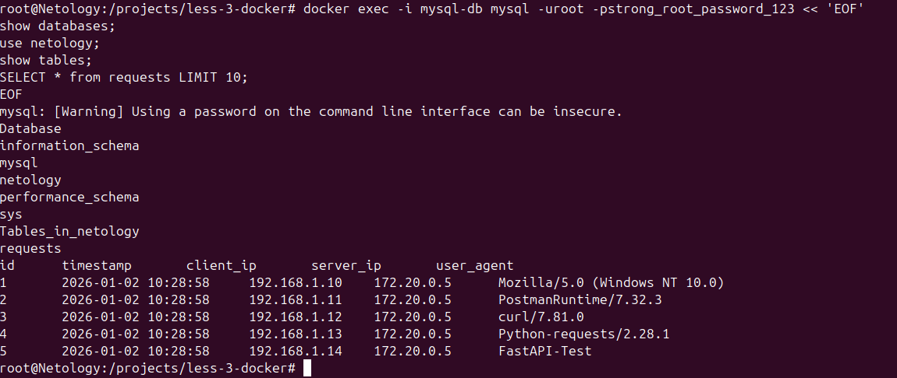
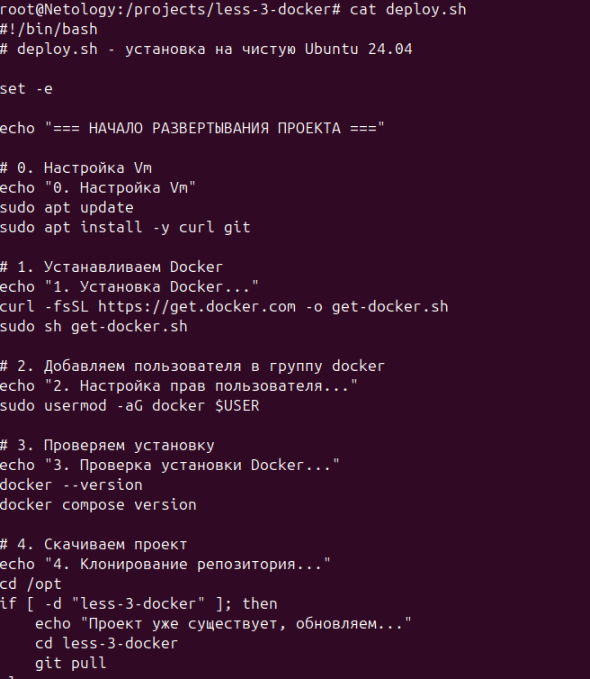
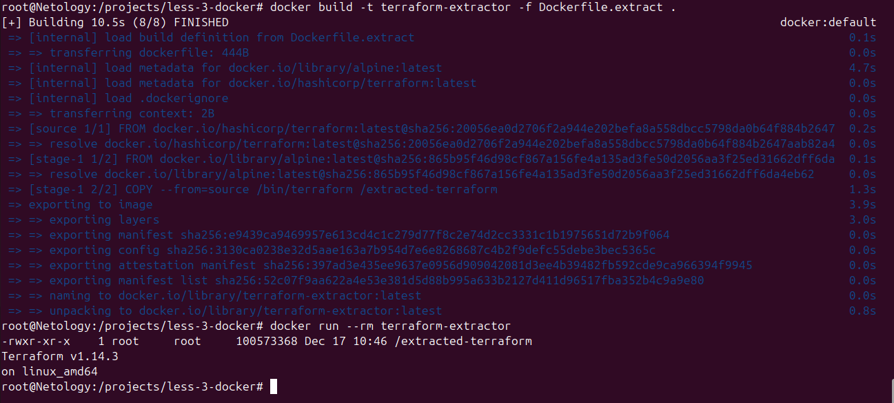
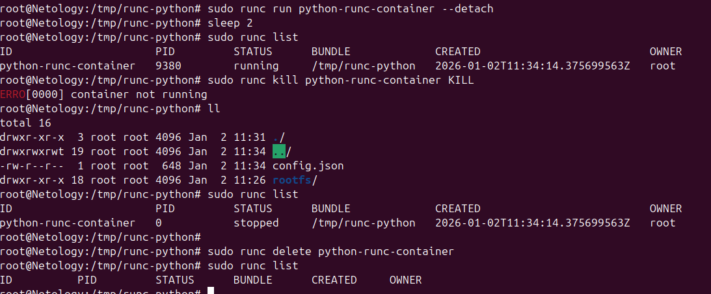

---

# Домашнее задание : «Практическое применение Docker»
<!-- Долго думал, как сделать и решил оформить так -->

**Студент:** [Вяткин А.И]  
**Группа:** [DevOps-инженер: курс для действующих IT-специалистов]  
**Дата выполнения:** $(date +"%d.%m.%Y")

---
### Задание 0: Проверка окружения Docker
**Цель:** Убедиться в правильной установке Docker Compose V2

**Результат:** 
- `docker-compose` (старая версия) не установлен ✓
- `docker compose` (V2) версии 5.0.0 установлен ✓

**Скриншот:**  


**Подробнее:** [task0-docker-setup/README.md](task0-docker-setup/README.md)

---

### Задание 1: Создание Dockerfile.python
**Цель:** Создать Dockerfile для Python приложения

**Созданные файлы:**
- `Dockerfile.python` - Dockerfile на основе python:3.12-slim
- `.dockerignore` - исключение ненужных файлов
- `main.py` - FastAPI приложение
- `requirements.txt` - зависимости Python

**Скриншот:**  


**Подробнее:** [task1-dockerfile/README.md](task1-dockerfile/README.md)

---

### Задание 3: Docker Compose конфигурация
**Цель:** Настроить multi-container приложение с Docker Compose

**Конфигурация:**
- **web:** FastAPI приложение (172.20.0.5)
- **db:** MySQL 8 (172.20.0.10) 
- **proxy:** Nginx + HAProxy (порт 8090)

**База данных:** `netology`

**Скриншот:**  


**Подробнее:** [task3-docker-compose/README.md](task3-docker-compose/README.md)

---

### Задание 4: Деплой на Yandex Cloud VM
**Цель:** Развернуть проект на облачной виртуальной машине

**Скрипт:** `deploy.sh` - автоматическая установка и запуск

**Цепочка трафика:**  
Пользователь → Internet → Nginx → HAProxy → FastAPI → MySQL

**Скриншот:**  


**Подробнее:** [task4-cloud-deploy/README.md](task4-cloud-deploy/README.md)

---

### Задание 5: Резервное копирование MySQL
**Цель:** Настроить автоматическое резервное копирование БД

**Скрипт:** `backup-mysql.sh` - создание дампа базы `netology`

**Cron:** Запуск каждую минуту, хранение последних 10 бэкапов

**Скриншот:**  


**Подробнее:** [task5-mysql-backup/README.md](task5-mysql-backup/README.md)

---

### Задание 6: Извлечение бинарного файла Terraform
**Цель:** Извлечь /bin/terraform из Docker образа разными способами

**Методы:**
1. `docker save` + `tar` + поиск в слоях
2. `docker cp` - простой копирование
3. `docker build` - многостадийная сборка

**Скриншот:**  


**Подробнее:** [task6-terraform-extract/README.md](task6-terraform-extract/README.md)

---

### Задание 7: Запуск через runC
**Цель:** Запустить контейнер через runC без Docker/containerd

**Процесс:**
1. Экспорт rootfs из Docker образа
2. Создание OCI конфигурации (config.json)
3. Запуск через `runc run`

**Скриншот:**  


**Подробнее:** [task7-runc-launch/README.md](task7-runc-launch/README.md)

---

## Cтарт

### Локальный запуск:
```bash
cd task3-docker-compose
docker compose up -d
curl http://localhost:8090
```
---